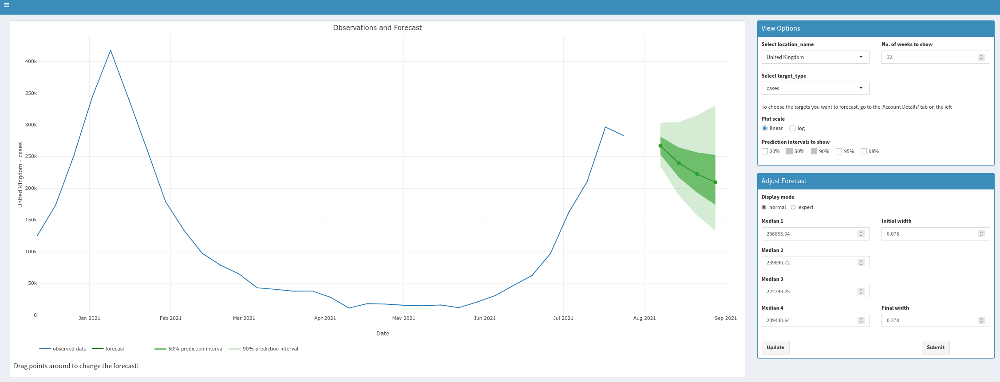

<strong>[Twitter bots](/twitter-bots)</strong>
<em>Twitter bots I built</em>
 

<strong>[Crowdforecastr](/crowdforecastr)</strong>
<em>A platform for human time series predictions</em>

<strong>scoringutils</strong>
<em>An R package to evaluate foreasts</em>

<strong>UK COVID-19 Crowd Forecasting Challenge</strong>
<em>A competition I organised to predict COVID-19 in the UK</em>

<strong>followtheargument</strong>
<em>My private blog</em>

<strong>Charity Bets</strong>
<em>Shoot by dusign on 2019-12-08</em>
拍摄于宁波，暂无说明

<strong>Project ideas</strong>
<em>Shoot by dusign on 2019-12-08</em>
拍摄于宁波，暂无说明

- master thesis
- Stock market prediction project
- mirmeth

